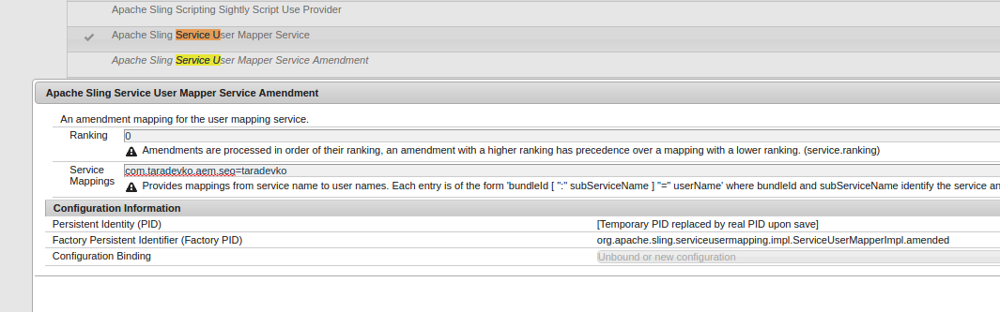
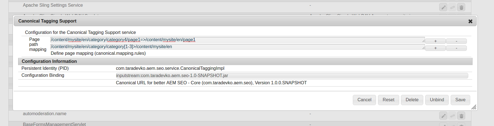
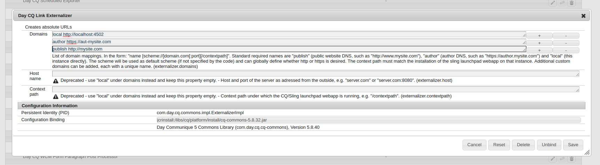
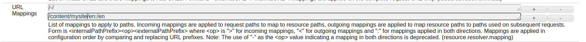
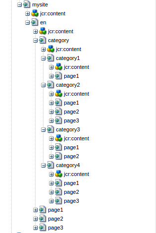
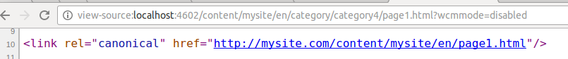
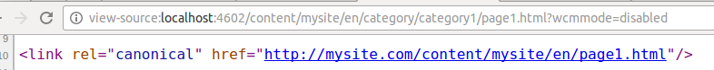
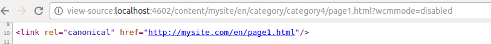

[](https://travis-ci.org/otarsko/aem-seo-canonical-url)
[](https://coveralls.io/github/otarsko/aem-seo-canonical-url?branch=master)
[](https://opensource.org/licenses/Apache-2.0)

# Canonical Tagging Support for AEM
This is a library for inserting canonical tags into you pages.

## Why
Many sites requires content duplication. For example, there can be a sub-tree for each department in the company,
where they have their content. However, they may have content which is equal to content in the corporate section.

At the same time, content duplication can greatly affect your ranking.
Unfortunately, AEM does not provide flexible way of handling this.

## What
This library provides next features:

* strict mapping, e.g. /path/page1 --(has canonical page)--> /anotherPath/page1
* mapping by the pattern with lookup path, e.g. /path/page[0-9] --(all pages under path have canonical pages)--> /anotherPath

Library has been tested on AEM 6.1 SP1, and JDK 7/8.

## How
To build and install bundle to your AEM instance, use next command (host/port values should be adjusted to the values you have):

`mvn clean install -PautoInstallBundle -Daem.host=localhost -Daem.port=4502`

After bundle installed, next steps should be performed:

1. [Create system user](http://www.aemcq5tutorials.com/tutorials/create-system-user-in-aem/), grant required permissions to it and configure it for the bundle *com.taradevko.aem.seo*:

 

 

1. Configure service *Canonical Tagging Support* (pid com.taradevko.aem.seo.service.CanonicalTaggingImpl). Via Web Console/sling:OsgiConfig:

 

 Rule has next syntax:

 * for **strict** rules, where page is mapped to another page: `_PATH PAGE 1_=>_CANONICAL PAGE PATH_`
 * for rules which map pages by regex and provide lookup path: `_PATTERN FOR PAGE WHICH CHILD WILL BE MAPPED_>_LOOKUP PATH_`

1. Add canonical tag to your <head></head>. To do this: insert next code into the required place:
    ```
          <link
              data-sly-use.canonicalTagging="com.taradevko.aem.seo.CanonicalLinkModel"
              data-sly-test="${canonicalTagging.hasCanonicalPage}"
              rel="canonical"
              href="${canonicalTagging.canonicalUrl}.html" />
    ```
1. Make sure, that externalizer is configured. Also, you can additionally configure URL Mappings in Resource Resolver Factory, to omit some part of the path in URL.

 

 

## Examples
Page structure:

 

Having configuration and structure, how it is shown above, we will get next results:

* strict rule

 

* pattern rule

 

* pattern rule with url mapping

 
